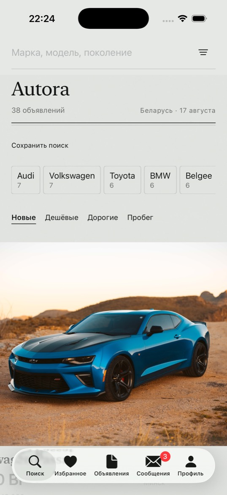

# Autora / CoolAV

iOS-приложение **CoolAV.by**: купить или продать легковушку в Беларуси.

Сейчас это рабочий клиент на демо-данных. Визуал совпадает с сайтом CoolAV (белый холст, чёрные кнопки, гараж, VIN, оценка). Без сайта av.by и без их бренда.



## Что умеет

- Лента объявлений, фильтры марка → модель → поколение
- Карточка с фото, ценой в **Br**, USD только справочно
- Избранное и сохранённые поиски на этом устройстве
- Чат и звонок продавцу (демо-вход)
- Подача своего объявления, поднятие раз в 20 часов
- Сравнение до трёх машин

Цена в данных всегда в белорусских рублях. Курс НБРБ в сиде: 2,99 Br за $1.

## Как запустить

Нужны **Xcode 26** и симулятор **iPhone 17**.

1. Клонировать репозиторий и открыть `Autora.xcodeproj`.
2. Выбрать схему **Autora**, team `LSCCP92LMG` (или свой).
3. Run.

Лента читается из `Autora/Resources/seed.json`. Firebase для этого **не нужен**.

```bash
DEVELOPER_DIR=/Applications/Xcode.app/Contents/Developer \
xcodebuild -project Autora.xcodeproj -scheme Autora \
  -destination 'platform=iOS Simulator,name=iPhone 17' \
  -derivedDataPath /tmp/AutoraDerived test
```

Тесты: **84 unit + 5 UI**. UI на русском, имена тестов на английском.

## Демо-данные

| Файл | Зачем |
| :--- | :--- |
| `Autora/Resources/seed.json` | 40 объявлений, 3 чата, курс |
| `Autora/Resources/catalog.json` | марки / модели / поколения РБ |
| `firebase/functions/seed.json` | тот же сид для Cloud Functions |

Сессия, свои лоты, избранное и черновик живут в UserDefaults. После перезапуска не пропадают.

## Firebase

Bundle: `com.borisdev.Autora`. Проект: `serzhanovich-ecosystem-ce700`. Плист: `Autora/GoogleService-Info.plist`.

Чтобы чат и каталог совпали с CoolAV.by: Xcode → Add Package `https://github.com/firebase/firebase-ios-sdk` → **FirebaseAuth**, **FirebaseFirestore**, **FirebaseStorage**.

Функции: `autoraSeedDemo`, `autoraAdminOverview`, `autoraVinCheck`, `autoraValuate`, `autoraRefreshFx`, `autoraModerateListing`. Коллекции только `autora_*`.

Не деплоить `firestore.autora.snippet.rules` соло. Не трогать Yoga/Wardrobe/Workout/Food.

## Структура

```
Autora/           клиент SwiftUI (iOS 18.6+, Swift 6)
AutoraTests/      домен и AppModel
AutoraUITests/    пять пользовательских путей
docs/             ADR, дизайн, потоки
firebase/         functions codebase autora
```

## Правила

- UI на русском
- Не парсить av.by и не копировать их ассеты
- Не удалять Firebase Auth UID соседних приложений в том же проекте
